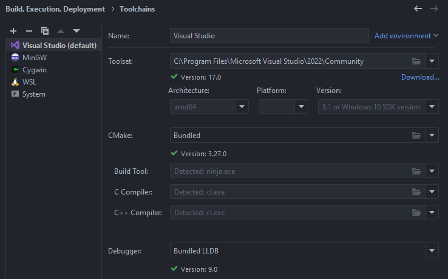
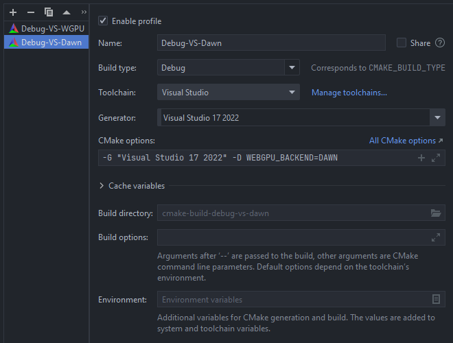

# WebGPU C++ Renderer

> [!WARNING]
> Work in Progress
> Building to web currently unsupported.


## About

This is a personal WebGPU C++ template to allow cross-platform compatibility based off of the [WebGPU C++ Guide](https://eliemichel.github.io/LearnWebGPU).

### Dependencies
- [`GLFW`](https://github.com/glfw/glfw): Window creation
- [`WEBGPU`](https://github.com/eliemichel/WebGPU-distribution): WebGPU distribution
  - [`WGPU-Native`](https://github.com/gfx-rs/wgpu-native): Native interface to [`wgpu`](https://github.com/gfx-rs/wgpu) Rust library developed for Firefox
  - [`Dawn`](https://dawn.googlesource.com/dawn): Google's WebGPU implementation developed for Chrome in C++
- [`WebGPU-Cpp`](https://github.com/eliemichel/WebGPU-Cpp): WebGPU C++ Wrapper
- [`GLFW3 WebGPU`](https://github.com/eliemichel/WebGPU-Cpp): Wrapper for GLFW to support cross-platform WebGPU
- [`ImGui`](https://github.com/ocornut/imgui): Lightweight dev gui
- [`GLM`](https://github.com/g-truc/glm): Math library

_All of these are included through git submodules._

---

## Setup

### Build Requirements
- [`cmake`](https://cmake.org): 3.20+
- a modern C++17 compiler: (`gcc-8`, `clang-6.0`, `MSVC 2017` or above)
- [`Emscripten`](https://github.com/emscripten-core/emscripten): (Required for building to web)

> [!NOTE]  
> On Windows I was unable to build and run using any build system except MSVC. MinGW and Cygwin could not track some specific Windows SDK headers (e.g. DirectX Compiler) among other issues. WSL is also unsupported as far as I can tell as well. YMMV

---

### Build via Command-Line
- Clone this project using git.
- From the root of this project update all the submodules with `git submodule update --init --recursive`.
- Follow the command-line instructions below:

  ```
  cmake . -B build ${OPTIONS}
  cmake --build build
  ```

#### ${OPTIONS}
Use `-G ${GENERATOR}` to use a specific [build system](https://cmake.org/cmake/help/latest/manual/cmake-generators.7.html) (e.g. `"Unix Makefiles"`, `"Visual Studio 17 2022"`, etc.).

Use `-D WEBGPU_BACKEND=${BACKEND}` to use a specific WebGPU platform (e.g. `DAWN` or `WGPU`). Defaults to `WGPU`.

#### Run
Execute either `./build/app` (linux/macOS/MinGW) or `build/Debug/app.exe` (MSVC).

---

### Build via CMake Compatible IDE (CLion)

- Clone this project using git.
- From the root of this project update all the submodules with `git submodule update --init --recursive`
- Open the project in an editor that directly supports CMAKE files.

Within `Build, Execution, Deployment` -> `Toolchains`, drag `Visual Studio` to the top of the list to make it the default option.




Next, navigate to `Build, Execution, Deployment` -> `CMake`, selecting your corresponding toolchain and generator. Append to the `CMake options:` field: `-D WEBGPU_BACKEND=${BACKEND}` where `${BACKEND}` is either `WGPU` or `DAWN`.

> [!TIP]  
> A second CMake profile may be created to build to both platforms.



Reload your CMake project.

---

## Project Structure
- `build`: Generated build files and binary application.
- `data`: Screenshots and other data.
- `docs`: Personal notes and documentation for learning.
- `external`: External dependencies (e.g. git submodules).
- `resources`: Project resources such as textures, sounds, music, etc.
- `src`: Source code

---
